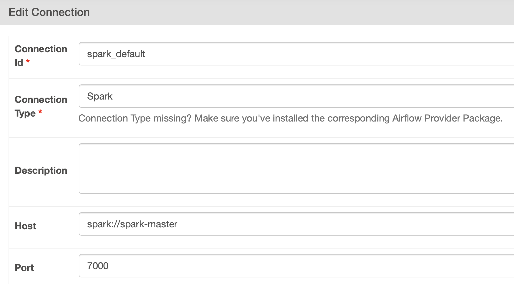

# Spark KDC Data Pipeline

## Контейнеры
В данном проекте находятся следующие контейнеры:

* **minio-kpfu-data-storage** - MinIO хранилище, содержит бакет с исходными данными
  * image: bitnami/minio
  * порты: 9000 для S3 API и 9001 для управления хранилищем вручную

* **postgresql** - база данных PostgreSQL, используемая Apache Airflow для хранения стейта, метаинформации и так далее
  * image: bitnami/postgresql
  * порты: 5432 для JDBC

* **airflow** - веб-сервер Apache Airflow
  * image: bitnami/airflow и кастомный билд
  * порты: 8080 для управления DAGs, подключениями и так далее

* **airflow-scheduler** - планировщик Apache Airflow
  * image: bitnami/airflow-scheduler и кастомный билд

* **spark-master** - Apache Spark master-узел standalone Spark кластера
  * image: bitnami/spark
  * порты: 7000 для подключения рабочих узлов и spark-submit джобов, 8000 - веб-интерфейс

* **spark-worker1** - Apache Spark worker-узел standalone Spark кластера
  * image: bitnami/spark
  * порты: 7001 для обратного взаимодействия с master-узлом, 8001 - веб-интерфейс

* **spark-worker2** - Apache Spark worker-узел standalone Spark кластера
  * image: bitnami/spark
  * порты: 7002 для обратного взаимодействия с master-узлом, 8002 - веб-интерфейс

* **kdc-clickhouse-local** - база данных ClickHouse, выступающая в качестве Data Mart
  * image: bitnami/clickhouse
  * порты: 8123 для JDBC

## Архитектура


## Начало работы

### Склонируйте репозиторий
```
git clone https://github.com/spark-kdc/kdc-data-pipeline.git
```

### Подготовьте рабочую директорию
В Вашей рабочей директории создайте папки:
```
mkdir dags plugins logs
```
Помимо этого разверните виртуальное окружение Python 3.11
```
python3.11 -m venv .venv
source ./.venv/bin/activate
```
Установите необходимые пакеты, например
```
pip install pyspark apache-airflow-providers-apache-spark
```
Находясь в этой же директории опишите requirements.txt
```
pip freeze > requirements.txt
```

### Поднимите контейнеры и билды
```
cd docker
docker-compose up -d --build
```

### Дальнейшие шаги
Для начала загрузите в хранилище Ваши первые файлы для обработки. В рамках этого хакатона - это CSV файлы. Рассмотрим простой пример: Дан dummy.csv, со следующим незамысловатым содержанием:
```csv
name,age
Alice,37
Bob,40
...
```

#### Разметим витрину
Создадим витрину ClickHouse: в ее качестве будет выступать таблица dummy:
```sql
create database kdc_test;
create table kdc_test.dummy (
  name String,
  age UInt8
) engine MergeTree()
primary key (name, age);
```
А теперь напишем первую Spark джобу, которая будет считывать этот файл, (возможно) его менять и загружать в ClickHouse.

#### Пример на Python
Первым делом в dags/ создаим директорию, содержащую наши PySpark джобы:
```
mkdir dags/pyspark-jobs
cd dags/pyspark-jobs
```
И в ней и опишем наш ETL процесс:
```python
from pyspark.sql import SparkSession

def main():
  spark = SparkSession \
    .builder \
    .appName('spark-app') \
    .getOrCreate()
  
  spark._jsc.hadoopConfiguration().set('fs.s3a.access.key', 'u64ngV64T5CXXjxVuZQT')
  spark._jsc.hadoopConfiguration().set('fs.s3a.secret.key', 'zIkOy4s5b5GN6Sd68MJFYfOhr6ylbjqRHUKkZVkn')
  spark._jsc.hadoopConfiguration().set('fs.s3a.endpoint', 'http://minio-kpfu-data-storage:9000')
  spark._jsc.hadoopConfiguration().set('fs.s3a.path.style.access', 'true')
  spark._jsc.hadoopConfiguration().set('fs.s3a.connection.ssl.enabled', 'false')
  spark._jsc.hadoopConfiguration().set('fs.s3a.impl', 'org.apache.hadoop.fs.s3a.S3AFileSystem')
  
  df = spark \
    .read \
    .csv('s3a://kpfu-data/dummy/dummy.csv', header=True, inferSchema=True)
  
  df \
    .write \
    .mode('append') \
    .format('jdbc') \
    .option('driver', 'com.clickhouse.jdbc.ClickHouseDriver') \
    .option('url', 'jdbc:clickhouse://kdc-clickhouse-local:8123') \
    .option('dbtable', 'kdc_test.dummy') \
    .option('user', 'airflow') \
    .option('password', 'airflow') \
    .save()
  
  df.show()

  spark.stop()


if __name__ == '__main__':
  main()
```

Теперь напишем DAG, содержащий задачу (operator task), запускающую этот код
**Note**: тут стоит отметить, что засабмитить Spark джобу можно разными способоми: от BashOperator до SparkSubmitOperator и KubernetesOperator. В рамках примера рассмотрим SparkSubmitOperator:
```python
from airflow import DAG
from airflow.providers.apache.spark.operators.spark_submit import SparkSubmitOperator
from datetime import datetime

with DAG('spark_submit_job',
         start_date=datetime.now(),
         schedule_interval='@once') as dag:
  etl = SparkSubmitOperator(
    task_id='submit_job_with_spark_submit',
    conn_id='spark_default',
    # требуются в контексте нашей задачи
    packages='org.apache.hadoop:hadoop-aws:3.3.4,org.apache.hadoop:hadoop-yarn-common:3.3.4,org.apache.httpcomponents.client5:httpclient5:5.3.1,org.apache.httpcomponents:httpcore:4.4.13,com.clickhouse:clickhouse-jdbc:0.6.0-patch3',
    application='./pyspark-jobs/pyspark-script.py'
  )
```

Теперь нам необходимо настроить подключение к Spark кластеру в панели управления Airflow Webserver. Во-первых, нужно установить Python модуль apache-airflow-providers-apache-spark, а во-вторых, перейти в панель управления -> Admin -> Connections -> spark_default:


После этого мы можем вручную стриггерить наш DAG, после чего, запустится наша джоба.

#### Пример на Scala
В силу того, что Spark написан на Scala, будет не очень красиво обойти этот прекрасный язык и не показать пример похожей джобы на нем:

Создадим Scala проект
```
sbt new scala/scala-seed.g8
```

Настроим проект. Во-первых, для того, чтобы отправлять джобы, написанные на JVM языках, необходимо собрать их в fat jars. Поэтому подключим assembly-плагин:
```sbt
addSbtPlugin("com.eed3si9n" % "sbt-assembly" % "2.2.0")
```
Настроим build.sbt:
```sbt
val sparkVersion          = "3.5.1"
val clickHouseJdbcVersion = "0.6.0-patch3"
val hadoopAwsVersion      = "3.3.4"
val hadoopYarnVersion     = "3.3.4"

val root = (project in file("."))
  .settings(
    inThisBuild(
      List(
        organization := "ru.sparkkdc",
        scalaVersion := "2.12.18"
      )
    ),
    name := "kdc-etl",
    libraryDependencies ++= Seq(
      "org.apache.spark"  %% "spark-core"         % sparkVersion          % "provided",
      "org.apache.spark"  %% "spark-sql"          % sparkVersion          % "provided",
      "org.apache.spark"  %% "spark-streaming"    % sparkVersion          % "provided",
      "com.clickhouse"    %  "clickhouse-jdbc"    % clickHouseJdbcVersion % "provided",
      "org.apache.hadoop" %  "hadoop-aws"         % hadoopAwsVersion      % "provided",
      "org.apache.hadoop" %  "hadoop-yarn-common" % hadoopYarnVersion     % "provided",
    ),
    assembly / mainClass := Some("ru.sparkkdc.Main"),
    assembly / assemblyJarName := "etl.jar"
  )
```

Ну и напишем нашу джобу:
```scala
package ru.sparkkdc

import org.apache.spark.sql.SparkSession

object Main {
  def main(args: Array[String]): Unit = {
    val spark = SparkSession
      .builder
      .appName("spark-app")
      .getOrCreate()

    spark.sparkContext
      .hadoopConfiguration
      .set("fs.s3a.access.key", "u64ngV64T5CXXjxVuZQT")

    spark.sparkContext
      .hadoopConfiguration
      .set("fs.s3a.secret.key", "zIkOy4s5b5GN6Sd68MJFYfOhr6ylbjqRHUKkZVkn")

    spark.sparkContext
      .hadoopConfiguration
      .set("fs.s3a.endpoint", "http://minio-kpfu-data-storage:9000")

    spark.sparkContext
      .hadoopConfiguration
      .set("fs.s3a.path.style.access", "true")

    spark.sparkContext
      .hadoopConfiguration
      .set("fs.s3a.connection.ssl.enabled", "false")

    spark.sparkContext
      .hadoopConfiguration
      .set("fs.s3a.impl", "org.apache.hadoop.fs.s3a.S3AFileSystem")

    val df = spark.read
      .option("header", "true")
      .option("inferSchema", "true")
      .csv("s3a://kpfu-data/dummy/dummy.csv")

    df.write
      .mode("append")
      .format("jdbc")
      .option("driver", "com.clickhouse.jdbc.ClickHouseDriver")
      .option("url", "jdbc:clickhouse://kdc-clickhouse-local:8123")
      .option("dbtable", "kdc_test.dummy")
      .option("user", "airflow")
      .option("password", "airflow")
      .save

    spark.stop
  }
}

```
В этот раз давайте попробуем использовать BashOperator для сабмита нашей джобы на кластер:
```python
from airflow import DAG
from airflow.operators.bash import BashOperator
from datetime import datetime

with DAG('spark_submit_job',
         start_date=datetime.now(),
         schedule_interval='@once') as dag:

  etl = BashOperator(
    task_id='submit_job_with_bash',
    bash_command="spark-submit --master spark://spark-master:7000 --packages org.apache.hadoop:hadoop-aws:3.3.4,org.apache.hadoop:hadoop-yarn-common:3.3.4,org.apache.httpcomponents.client5:httpclient5:5.3.1,org.apache.httpcomponents:httpcore:4.4.13,com.clickhouse:clickhouse-jdbc:0.6.0-patch3 --conf spark.driver.extraJavaOptions=\"-Divy.cache.dir=/tmp -Divy.home=/tmp\" /opt/bitnami/airflow/dags/scala-jobs/etl.jar"
  )
```

### Вывод
Примерно похожим образом и выглядел наш флоу работы с данными. Добавьте сюда преобразования исходных данных, их трансформации, загрузка данных не в локальный ClickHouse, а в ClickHouse Cluster в Yandex Cloud и Вы получите хоть и простой, но рабочий Data Pipeline.